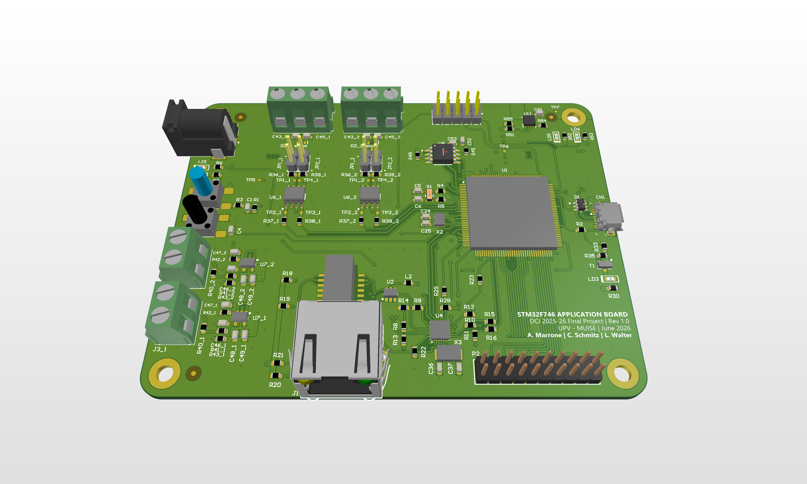
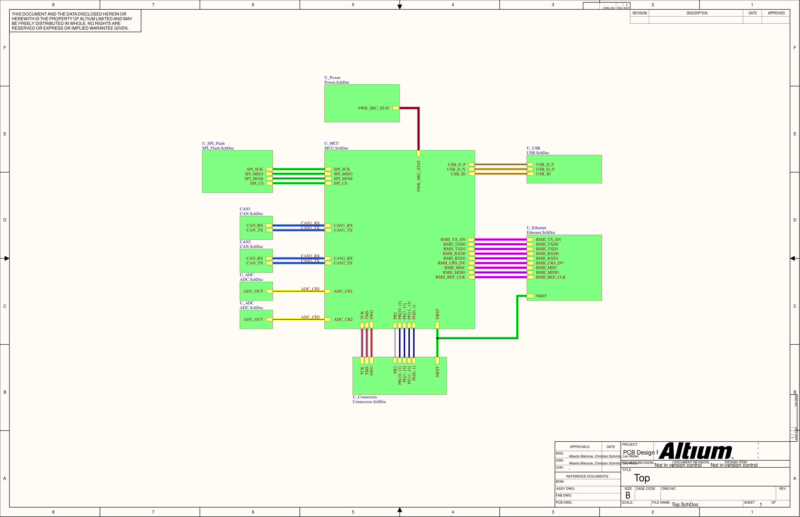
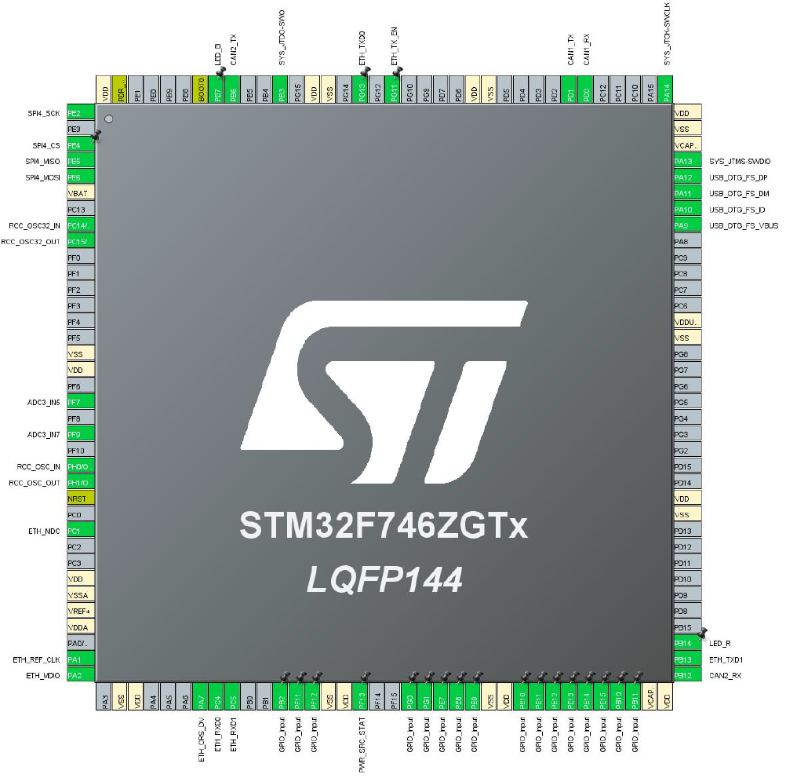
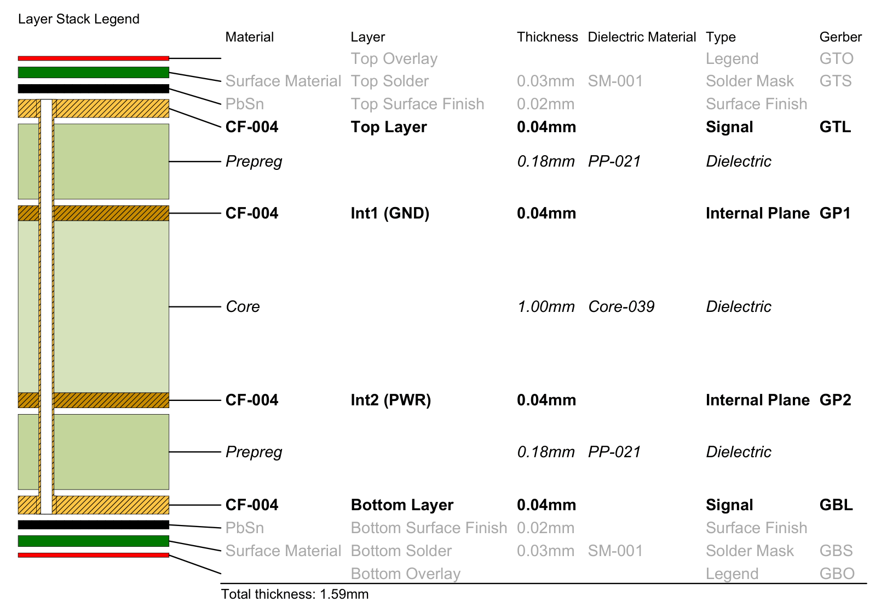
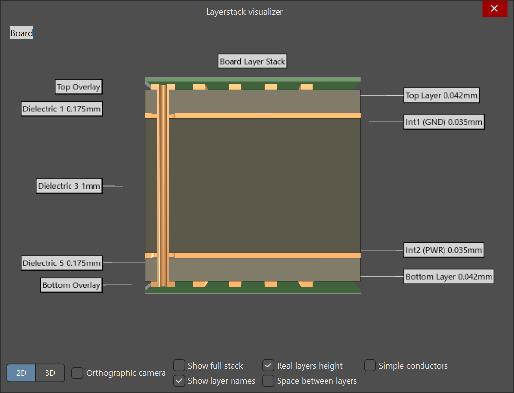
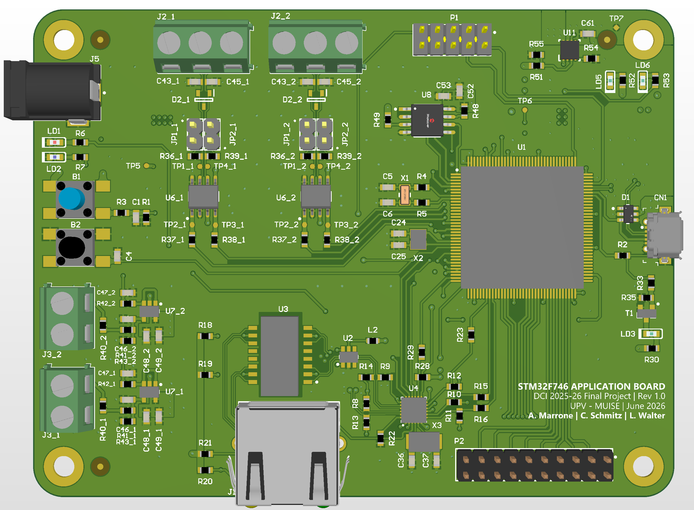
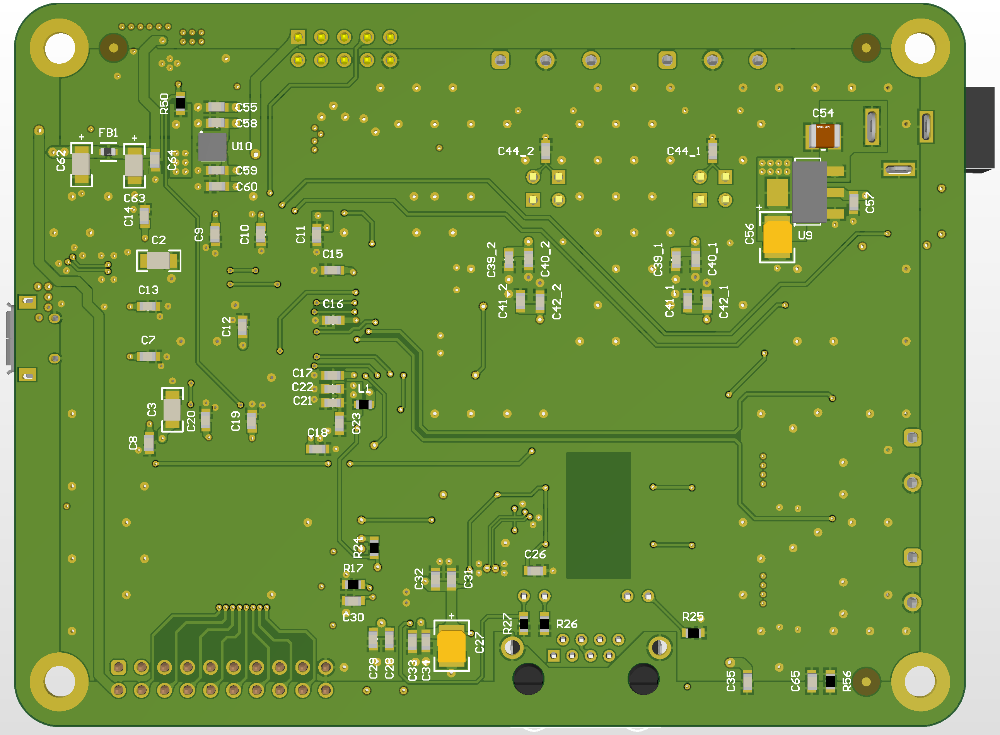

<div align="center">

# STM32F746ZG — Custom Application Board

**Custom-designed four-layer PCB built around the STM32F746ZGTx (LQFP-144) —
covering the full design cycle from hierarchical schematic capture to impedance-controlled layout and manufacturing outputs.**

[](https://www.st.com/en/microcontrollers-microprocessors/stm32f746zg.html)
[](https://www.altium.com/)
[](https://www.altium.com/altium-365)
[]()
[](https://www.lab-circuits.com)
[](LICENSE)

*Alberto Marrone · Christian Schmitz · Leo Walter*
*Diseño de Circuitos Impresos (DCI) — UPV MUISE, June 2026*

<br/>



</div>

---

## Overview

This project documents the complete hardware design of a custom STM32F746ZGTx application board, derived from the [ST NUCLEO-F746ZG](https://www.st.com/en/evaluation-tools/nucleo-f746zg.html) reference design. The on-board ST-LINK debugger, Morpho/Zio expansion headers, and all peripherals not required by the project specification were removed. The remaining circuitry was redesigned and extended to implement all required interfaces on a custom four-layer PCB.

The design was carried out by a **three-person team** using **Altium Designer 26** with **Altium 365**, which provided real-time cloud-based concurrent editing, integrated version control, and design review workflows natively within the tool — enabling all three team members to work on the same project simultaneously without file conflicts.

> **Note:** This board was designed as an academic project and has not been fabricated or assembled. This repository is a static export of the completed design; the Altium 365 cloud workspace is not linked here.

---

## ⚙️ Interfaces

| Block | Implementation |
|---|---|
| **Microcontroller** | STM32F746ZGTx, LQFP-144, direct-solder |
| **Ethernet** | LAN8742A-CZ-TR PHY (RMII), KMS-1102NL magnetics, KRJ-CB4.2GYZNL RJ45 |
| **USB** | Micro-AB OTG FS (Molex 475900001), ESDA6V1BC6 ESD protection, STMPS2151STR VBUS switch |
| **CAN** | 2× CAN transceiver channels, switchable 120 Ω termination, complex hierarchy |
| **Analog inputs** | 2× 0–10 V → 3.3 V conditioning channels, MCP6021 op-amp, complex hierarchy, ADC3 |
| **SPI Flash** | SST26VF032BA-104I/SM, 32 Mbit (4 MB), SOIJ-8, SPI mode |
| **GPIO expansion** | Würth 61301621121, 2×8 100 mil pitch, 16 signals |
| **Debug** | TSW-105-07-G-D, 2×5 100 mil SWD + SWO connector |
| **Power input** | PJ-002A DC barrel jack (preferred) + USB VBUS fallback via TPS2113A mux |
| **5 V rail** | LD1117S50TR LDO from VIN |
| **3.3 V rail** | LD39050PU33R LDO from 5 V bus |
| **BOOT0** | 10 kΩ pull-down + tact switch to VDD for DFU bootloader entry |
| **Clocks** | 8 MHz HSE crystal (→ PLL, 216 MHz system / 48 MHz USB), 32.768 kHz LSE (RTC) |

---

## 🧩 Schematic Architecture

The schematic is organized as a **hierarchical multi-sheet design** in Altium. A single top-level sheet instantiates all functional blocks and defines the inter-block signal connections. The CAN transceiver and ADC signal-conditioning blocks use **complex hierarchy** — one sheet per block, instantiated twice, one per channel — as required by the project specification.

<p align="center">
  
</p>

### MCU Pin Allocation

Peripheral assignment was defined in STM32CubeMX and locked before schematic capture began.

<p align="center">
  
</p>

| Peripheral | Pins |
|---|---|
| Ethernet RMII | PA1, PA2, PA7, PC1, PC4, PC5, PB13, PG11, PG13 |
| USB OTG FS | PA9 (VBUS), PA10 (ID), PA11 (DM), PA12 (DP) |
| CAN1 | PD0 (RX), PD1 (TX) |
| CAN2 | PB12 (RX), PB6 (TX) |
| SPI4 | PE2 (SCK), PE4 (CS), PE5 (MISO), PE6 (MOSI) |
| ADC3 | PF7 (IN5), PF9 (IN7) |
| SWD + SWO | PA13 (SWDIO), PA14 (SWDCLK), PB3 (SWO) |
| HSE | PH0, PH1 |
| LSE | PC14, PC15 |

The full clock tree configuration is documented in the [design report](Docs/DCI_Design_Report.pdf).

---

## 📐 PCB Stack-up

A four-layer stack-up was selected as a cost-effective balance between routing density and electrical performance. Thinner-than-standard prepregs (0.18 mm PP-021) bring the outer signal layers closer to their reference planes, yielding practical trace widths for the impedance profiles below — while keeping total board thickness within the 1.6 mm fabrication limit.

| Layer | Type | Material | Thickness | Role |
|---|---|---|---|---|
| **L1** | Signal | CF-004, 35 µm Cu | 0.04 mm | Critical signals — all high-speed components |
| | Prepreg | PP-021 | 0.18 mm | Thinned vs. standard for impedance |
| **L2** | GND Plane | CF-004, 35 µm Cu | 0.04 mm | Solid, unbroken — primary reference for L1 |
| | Core | Core-039 | 1.00 mm | FR-4 compatible dielectric |
| **L3** | Power Plane | CF-004, 35 µm Cu | 0.04 mm | Split: +3V3 / +5V regions |
| | Prepreg | PP-021 | 0.18 mm | |
| **L4** | Signal | CF-004, 35 µm Cu | 0.04 mm | Low-speed, non-critical signals only |
| **Total** | | | **1.59 mm** | Within 1.6 mm spec |

<p align="center">
  
  
</p>

The stack-up is **symmetric** about the board centre to prevent warpage during lamination and reflow. All critical interfaces (Ethernet RMII, USB DP/DM, CAN H/L, SPI Flash, oscillator traces) are routed on **L1**, directly above the solid **L2 GND plane**, with their components placed on the top side to eliminate layer transitions on critical paths. L4 is reserved for low-speed signals only, since the split L3 power plane does not provide a continuous return current path.

---

## 📡 Impedance-Controlled Routing

Profiles were calculated using the Altium Layer Stack Manager and applied as routing rules to the corresponding net classes. All four profiles hit their targets within ±0.03 Ω.

| Profile | Target | Trace Width | Pair Gap | Net Class |
|---|---|---|---|---|
| `S50` | 50 Ω single-ended | 0.304 mm | — | Controlled single-ended signals |
| `D90` | 90 Ω differential | 0.222 mm | 0.155 mm | `USB_HighSpeed` — USB_DP / USB_DM |
| `D100` | 100 Ω differential | 0.170 mm | 0.160 mm | `ETH_Diff` — Ethernet RMII pairs |
| `D120` | 120 Ω differential | 0.162 mm | 0.200 mm | `CAN_Diff` — CAN_H / CAN_L |

Differential pairs are routed with intra-pair length matching enforced as Altium rules. Return-current GND vias are placed at every layer transition, and GND stitching vias surround both crystal oscillator circuits (HSE and LSE).

---

## ✅ DFM — Lab Circuits Class 5

| Measure | Purpose |
|---|---|
| Class 5 throughout (0.15 mm min clearance, 35 µm Cu) | Standard Lab Circuits process — no premium options needed |
| Through-hole vias only | No HDI — avoids sequential lamination cost and complexity |
| Symmetric 4-layer stack-up | Prevents warpage during lamination and reflow |
| 45° routing, no 90° corners | Eliminates acid traps during chemical etching |
| Teardrops at all via–trace and pad–trace junctions | Robustness against drill registration tolerances |
| Via tenting: top covered, bottom open | Prevents solder mask blistering from trapped outgassing |
| GND copper pours on both outer layers | Uniform copper distribution — consistent plating and etching |
| Thermal reliefs on all plane-connected pads | Ensures pads reach reflow temperature reliably |
| Board-level fiducials on both outer layers | Optical reference for pick-and-place alignment |
| Rectangular outline with rounded corners | Minimises milling complexity |
| All connectors along board edges | Straightforward external cable routing |
| Decoupling caps placed directly under ICs (bottom layer) | Minimises parasitic inductance, preserves L1 routing space |

---

## 🖼️ Board Renders

<p align="center">
  
  
</p>

**Board dimensions:** 105 × 80 mm &nbsp;|&nbsp; **Mounting holes:** 4× M3.5, 6.5 mm annular ring

---

## Manufacturing Targets

| Parameter | Value |
|---|---|
| Manufacturer | Lab Circuits, Spain |
| Manufacturing class | Class 5 |
| Total board thickness | 1.59 mm (limit: 1.6 mm) |
| Copper weight | 35 µm (1 oz) all layers |
| Surface finish | HASL lead-free |
| Solder mask | Green |
| Via technology | Standard through-hole only |

---

## Repository Structure

```
STM32F746-Application-Board/
│
├── Hardware/
│   ├── Altium/                               Altium Designer 26 project files
│   │   ├── STM32F746_AppBoard.PrjPCB
│   │   ├── STM32F746_AppBoard.PcbDoc
│   │   ├── STM32F746_AppBoard.BomDoc
│   │   ├── STM32F746_AppBoard.DwfDot
│   │   ├── STM32F746_AppBoard.PCBDwf
│   │   ├── STM32F746_AppBoard.OutJob
│   │   ├── Top.SchDoc                        Top-level hierarchical sheet
│   │   ├── MCU.SchDoc                        STM32F746ZGTx + decoupling
│   │   ├── Power.SchDoc                      Power supply and distribution
│   │   ├── USB.SchDoc                        USB OTG FS interface
│   │   ├── Ethernet.SchDoc                   LAN8742A PHY + magnetics + RJ45
│   │   ├── CAN.SchDoc                        CAN transceiver (instantiated ×2)
│   │   ├── ADC.SchDoc                        0–10 V conditioner (instantiated ×2)
│   │   ├── SPI_Flash.SchDoc                  SPI Flash memory
│   │   └── Connectors.SchDoc                 SWD + GPIO expansion
│   │
│   ├── Libraries/
│   │   ├── STM32F746_AppBoard.SchLib
│   │   └── STM32F746_AppBoard.PcbLib
│   │
│   ├── CubeMX/
│   │   └── STM32F746_AppBoard.ioc
│   │
│   └── Exports/
│       ├── Schematic.pdf
│       └── Draftsman.pdf
│
├── Manufacturing/
│   ├── Gerbers/
│   │   └── Gerber_STM32F746_AppBoard.zip
│   └── Assembly/
│       ├── BOM_STM32F746_AppBoard.xlsx
│       └── PickPlace_STM32F746_AppBoard.csv
│
├── Docs/
│   └── DCI_Design_Report.pdf
│
├── Images/
│   ├── STM32F746_AppBoard.png
│   ├── STM32F746_AppBoard_Top.png
│   ├── STM32F746_AppBoard_Bottom.png
│   ├── Schematic_Overview.png
│   ├── CubeMX_Pinout.png
│   ├── Layerstack_Visualizer.png
│   └── Layerstack_Legend.png
│
├── .gitignore
├── LICENSE
└── README.md
```

---

## 📥 Downloads

| File | Description |
|---|---|
| [Schematic (PDF)](Hardware/Exports/Schematic.pdf) | Full schematic — all hierarchical sheets |
| [Draftsman (PDF)](Hardware/Exports/Draftsman.pdf) | Stack-up, layer views, board outline |
| [Design Report (PDF)](Docs/DCI_Design_Report.pdf) | Stack-up analysis, impedance profiles, DFM decisions |
| [BOM (xlsx)](Manufacturing/Assembly/BOM_STM32F746_AppBoard.xlsx) | Bill of materials |
| [Pick & Place (csv)](Manufacturing/Assembly/PickPlace_STM32F746_AppBoard.csv) | Assembly centroid data |
| [Gerbers + Drill](Manufacturing/Gerbers/Gerber_STM32F746_AppBoard.zip) | Production-ready Gerber X2 + NC Drill |
| [CubeMX Config (.ioc)](Hardware/CubeMX/STM32F746_AppBoard.ioc) | STM32CubeMX pin assignment and clock tree |

---

## 👥 Team

This project was developed as a three-person team for the *Diseño de Circuitos Impresos* (DCI) course at **Universitat Politècnica de València (UPV)**, MUISE programme, academic year 2025–26. Real-time concurrent editing and design review were managed through **Altium 365**.

| | Name | Profile |
|---|---|---|
| 🇮🇹 | Alberto Marrone | [](https://linkedin.com/in/alberto-marrone-444192274) |
| 🇩🇪 | Christian Schmitz | — |
| 🇩🇪 | Leo Walter | — |

| | Name | |
|---|---|---|
| 🇮🇹 | Alberto Marrone | [](https://linkedin.com/in/alberto-marrone-444192274) |
| 🇩🇪 | Christian Schmitz | [](https://linkedin.com/in/cschmitz-eng) |
| 🇩🇪 | Leo Walter | — |

---

## References

- Lab Circuits — [Multilayer manufacturing parameters, Class 5](https://www.lab-circuits.com/es/fabricacion-multicapa)
- STMicroelectronics — STM32F746ZGTx Datasheet and Reference Manual
- STMicroelectronics — AN2867: Oscillator design guide for STM32 microcontrollers
- STMicroelectronics — NUCLEO-F746ZG User Manual (UM1974)
- *Diseño de Circuitos Impresos* — UPV course material

---

## License

Released under the [MIT License](LICENSE).
`Copyright (c) 2026 Alberto Marrone, Christian Schmitz, Leo Walter`
